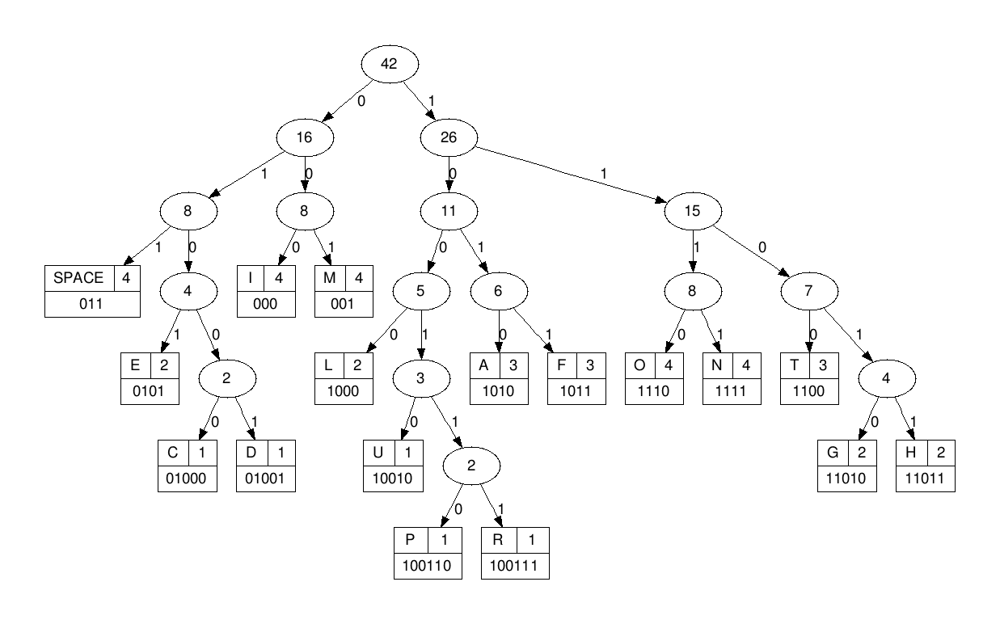

# Huffman-Compression-Algorithm
## Team 5
* Asmaa Mahmoud Mahmoud
* Alaa Gamal Abdelaziz
* Salma Mohamed Zakaria
* Marwa Adel Yousef
## How to Compile :
* We used CMake to make the compiling easier and less time consuming.
1. create a ```build``` folder and open it.
2. open the terminal.
3. write  ```cmake ..```
4. write  ```make ```
* The compilation is done.
* To compress a file: ```./compress ../data/carl_sagan.txt```
* to decompress a file ```./decompress binary.txt```
## Acheivements of Our Project:
* We were able to compress a file ```carl_sagan.txt``` which space is 2.1KB to a smaller file ```binary.txt``` which space is 1.1KB, 0.52 from the orignal file, which means we saved 48% of the space which is very memory efficient.
* And we were able to decompress the file to its original file without any losses to its original size.
## Explanation of Huffman :


* A minimal variable-length character coding based on the frequency of each character. First, each character becomes a one-node binary tree, with the character as the only node. The character's frequency is the tree's frequency. Two trees with the least frequencies are joined as the subtrees of a new root that is assigned the sum of their frequencies. Repeat until all characters are in one tree. One code bit represents each level. Thus more frequent characters are near the root and are coded with few bits, and rare characters are far from the root and are coded with many bits.

## Header Files:
### Huffman.hpp
* We structed a node which carry data , freq , left node and right node, then we name a namespace called haffman that has 4 functions which are :

1. makeTree :


 * Create a leaf node for each unique character and build a min heap of all leaf nodes (min heap is used as a priority queue) The value of frequency field is used to compare two nodes in min heap. Initially, the least frequent character is at root.

 * Extract two nodes with the minimum frequency from the min heap.

 * Create a new internal node with a frequency equal to the sum of the two nodes frequencies. Make the first extracted node as its left child and the other extracted node as its right child. Add this node to the min heap.

 * Repeat steps#2 and #3 until the heap contains only one node. The remaining node is the root node and the tree is complete.

2.  makeMap :
   * As we know data is found in the leaves so we stared to move from the root to the leaf by '0' or '1' (if we move left we add zero to the code if we move right we add 1 to the code) till we get the data in the leaf. 
   * This map carrys the data in the key and the data's code in the value.
   * The most repeated data has the smallest code and vice versa. 
3. encode :
* We attach the file contains all the data , iterate over each data in this file , we find the code of each data using the map that we made in the step before, then we add all of the codes in compressed file.
* We now minimize the size of the file that conatins the data.
4. decode :
 *   We took the compressed file, we follow zeros and  ones to a leaf and return the data (key) there. 
 * We used pointer to the root of the huffman tree and a bineary coded string to decode.
 * We return the file to its original case.
 ### SerializeTree.hpp
 
* The functions in this file transmits the tree's data and frequencies needed for the decompression file to an external file so the tree would be reachable in the decompression file without needing to look at the input text which is called serialization and deserialization.
### Helpers.hpp
* The functions in this file assists the main coding files in transmitting the data from and to the code, and converting the data to different forms.
 ## Main Files : 
 ### Compressed
* In this file by calling some functions from our header files it compresses any file to a smaller file without any loss of data.
 ### Decompressed
* In this file by calling some functions from our header files it decompresses any compressed file to its original size without any loss of data.
 ## Target :
  * Minimizing the size of the file while the data inside it is kept constant and return it back when we need that.
## Problems we have faced :
1. Using extern function to call a variable inside another file.
2. Serializing the tree with both data and frequency inside it.
3. Saving a binary string as binary bits not bytes.


